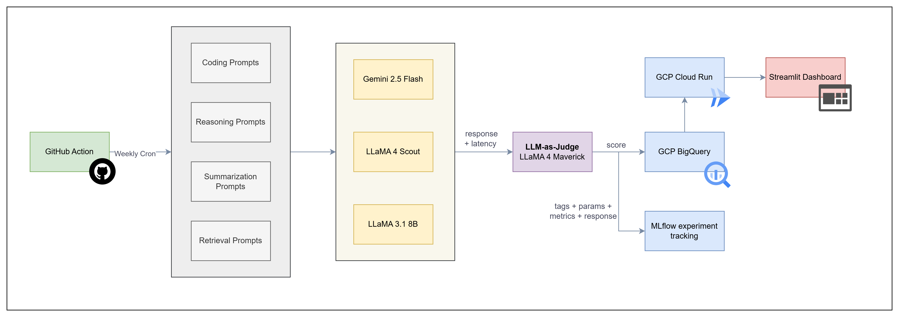

# LLM Evaluation & Benchmarking Platform

LLM Buddy helps you find the best LLM for your usecase.

An automated pipeline that evaluates multiple LLMs across task dimensions using 
LLM-as-a-judge scoring, MLflow experiment tracking, and BigQuery storage — with 
a live Streamlit leaderboard tracking model performance over time.

## Tech Stack
| Layer | Technology |
|---|---|
| Language | Python 3.11 |
| LLM APIs | Google Gemini, Groq |
| Experiment Tracking | MLflow |
| Local Storage | SQLite |
| Cloud Storage | GCP BigQuery |
| Dashboard | Streamlit |
| Containerization | Docker |
| Container Registry | GCP Artifact Registry |
| Deployment | GCP Cloud Run |
| Scheduler | GitHub Actions (weekly cron) |
| GCP Auth | Workload Identity Federation (keyless) |

**Live Dashboard:** https://llm-benchmarker-dashboard-738128790851.us-central1.run.app

## Architecture Diagram



## Models Evaluated
| Model | Provider | Role |
|---|---|---|
| Gemini 2.5 Flash | Google AI Studio | Candidate |
| LLaMA 4 Scout (17B) | Groq | Candidate |
| LLaMA 3.1 8B Instant | Groq | Candidate |
| LLaMA 4 Maverick (17B) | Groq | Judge |

## Task Categories
| Category |  What it tests |
|---|---|
| Coding | Correctness, debugging, design patterns |
| Reasoning | Logic, math, system design |
| Summarization | Clarity, conciseness, technical communication |
| RAG | Retrieval faithfulness, hallucination resistance |

## Scoring Dimensions
Each response is scored 1–10 on three dimensions:
- **Accuracy** — factual correctness and completeness of answer
- **Clarity** — structure, readability, and communication quality  
- **Completeness** — coverage of all aspects of the question


## Setup

### 1. Install dependencies
```bash
python -m venv venv
venv\Scripts\activate
pip install -r requirements.txt
```

### 2. Configure environment
```bash
# .env
GEMINI_API_KEY=your_gemini_key
GROQ_API_KEY=your_groq_key
GCP_PROJECT_ID=your_proj_id
BQ_DATASET=your_dataset
```

### 3. Run benchmark
```bash
python main.py
```

### 4. View results
```bash
# Streamlit dashboard
streamlit run dashboard/app.py

# MLflow experiment tracker
mlflow ui --backend-store-uri sqlite:///mlflow.db
```